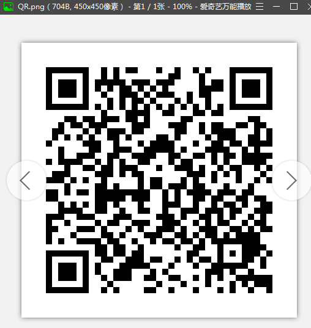
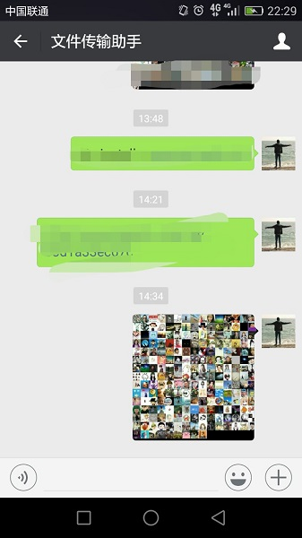

# itchat+pillow实现微信好友头像爬取和拼接

------

Forked from:  [github.com/15331094/wxImage](https://github.com/15331094/wxImage)

------


### 效果图


*screenshots 目录* 中也有我自己的运行结果，不过我虚化了一下（把好友的照片贴出来毕竟不太好）
***

### 使用方法（前提是设备安装了python3）：

下载本项目到本地，打开项目主目录，打开命令行，输入：

```python
pip install -r requirements.txt # 安装第三方依赖
```

等待安装完成，输入：

```python
python wechat-imgs.py
```


本地的图片查看软件会自动打开二维码（扫描后即自动删除）：



用手机微信右上角的扫一扫，确认登陆即可。

稍等片刻，你打开手机微信，找到信息栏的微信传输助手，会看到如下：



------


## 核心

python3：

- itchat (用于爬取头像)
- pillow (用于拼接图片)


## 源码解析

请直接查看：[wechat-imgs.py](https://github.com/aloneZERO/py-party/blob/master/wechat-imgs/wechat_imgs.py) （代码中有详细注释）

